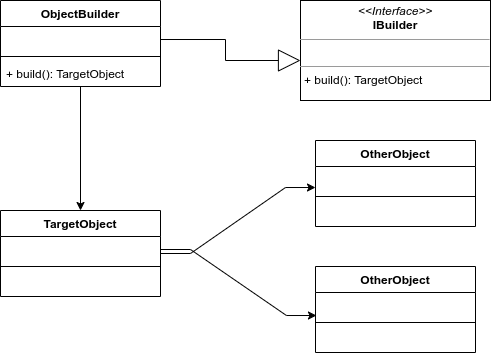

# Builder

Este es un patrón bastante simple, pero muy útil. que permite crear objectos complejos a través de uno más simple. Es muy común encontrarnos con situaciones en las cuales tenemos que crear objetos compuestos de forma manual y repetidas veces, lo que nos lleva a tener que establecer cada propiedad del objeto, y si este, además tiene objetos compuestos dentro, tenemos que crearlos primero para después ser asignados al objeto que estamos construyendo. Esto desde luego que se hace una tarea tediosa y cansada, sobre todo cuando tenemos que crear objetos de manera frecuente.

