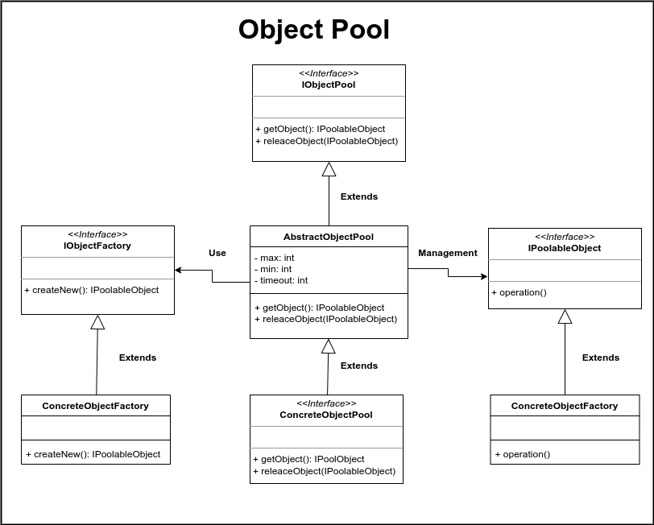

# Object Pool

Este es un patrón muy utilizado cuando se requiere trabajar con una gran cantidad de objetos, los cuales son computacionalmente caros de crear. Este patrón tiene una gran ventaja en escenarios donde nuestro programa requiere dichos objetos por un corto periodo de tiempo y que lugo de eso, son desechados. La ventaja que brinda este patrón es que nos permite reutilizar los objetos con el fin de evitar la tarea de crearlos cada vez que nuestra aplicación los requiere, menteniendo así un almacén de objetos creados previamente para ser utilizados.

