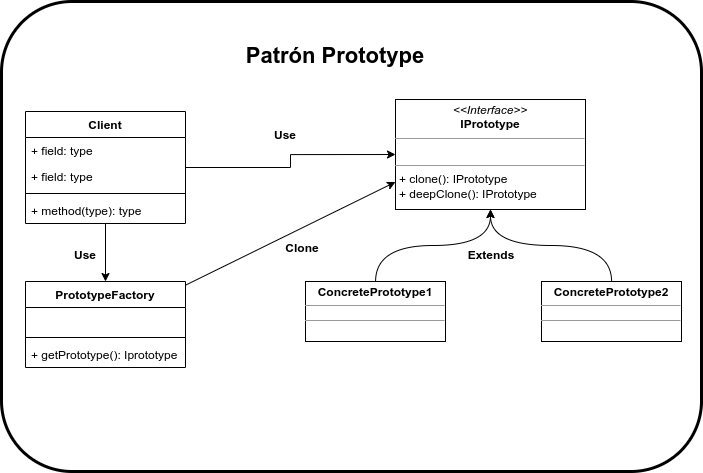

# Prototype

El patrón Prototype basa su funcionalidad en la clonación de objetos, estos nuevos objetos son creados mediante un pool de prototipos elaborados previamente y almacenados. Este patrón es especialmente útil cuando necesitamos crear objetos basados en otros ya existentes o cuando se necesita la creación de estructuras de objetos muy grandes, este patrón nos ayuda también a ocultar la estrategía utilizada para clonar objetos.

