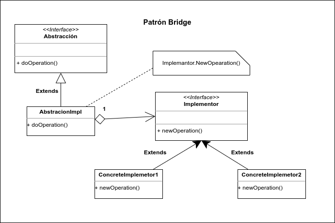

# Bridge

Bridge es un patrón de diseño utilizado para desacoplar una abstracción de su implementación de manera que las dos puedan ser modificadas por separadas sin necesidad de modificar la otra; dicho de otra manera, se desacopla una abstracción de su implementación para que puedan variar independientemente.

Bridge es muy utilizado cuando dos piezas de software están relacionadas directamente, sin embargo, eciste una gran probabilidad de que una de las dos partes cambie y esto puede llevar a la anecesidad de modificar la pieza del otro lado. Para solucionar este problema bridge propone crear una estructura de clases basada en la agregación, en la cual, una clase puente es utilizada parar desacoplar la clase que queremos utilizar y el cliente, de tal forma que este último no conozca la clase destino, permitiendo que cualquier parte pueda cambiar sin afectar a la otra.

Este patrón puede ser confundido con Adapter ya que incluso Bridge se implementa utilizando el patrón Adapter, sin embargo, existe una diferencia entre los dos, la cual es clave para distinguirlo, y es que Bridge se centra en desacoplar la abstracción a la implementación por lo que tiene sentido utilizarse cuando existen interfaces compatibles. En cambio Adapter es utilizada para resolver escenarios donde las interfaces no son compatibles.

