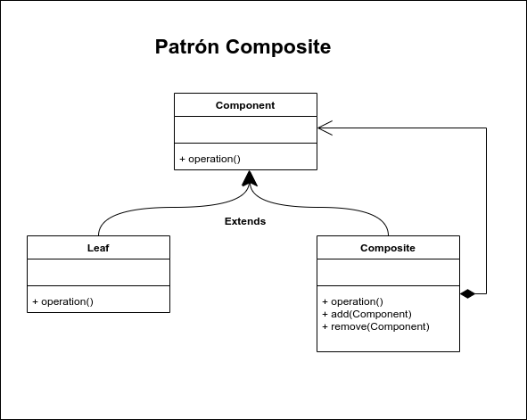

# Composite

Composite nos sirve para construir estructuras complejas partiendo de otras mucho más simples; dicho de otra manera, podemos crear estructuras compuestas que están conformadas por otras estructuras más pequeñas.

Este patrón es muy útil cuando requerimos manipular un conjunto de elementos muy parecidos entre si de una forma uniforme, por lo cual estas clases deben pertenecer a la misma familia y tener un ancestro en común, el cual define el comportamiento mínimo que deben tener para poder ser tratadas uniformemente y poder construir jerárquicas compuestas por objetos más simples. Los objetos simples y compuestos son conocidos como Leaf y Composite respectivamente y el ancestro en común es llamado Componente. Estas estructuras son construidas en forma de árbol en donde la recursividad juega un papel muy importante para sacar el máximo provecho a toda la estructura.

