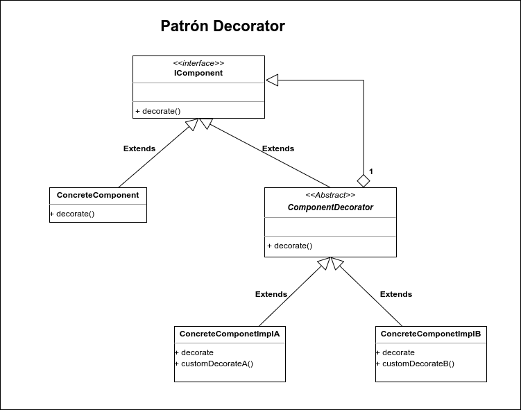

# Decorator

El patrón decorator está diseñado para solucionar problemas donde la jerarquía con subclasificación no puede ser aplicada, o se requiere de un gran impacto en todas las clases de la jerarquía con el fin de poder lograr el comportamiento esperado. Decorator permite al usuario añadir nuevas funcioonalidades a un objeto existente sin alterar su estructura, mediante la adición de nuevas clases que envuelven a la anteriro dándole funcionamiento  extra. 

Este patrón está diseñado con la finalidad de que múltiples decoradores puedan ser apilados uno encima del otro agregando funcionalidad por cada decorardor que es añadido a la estructura.

