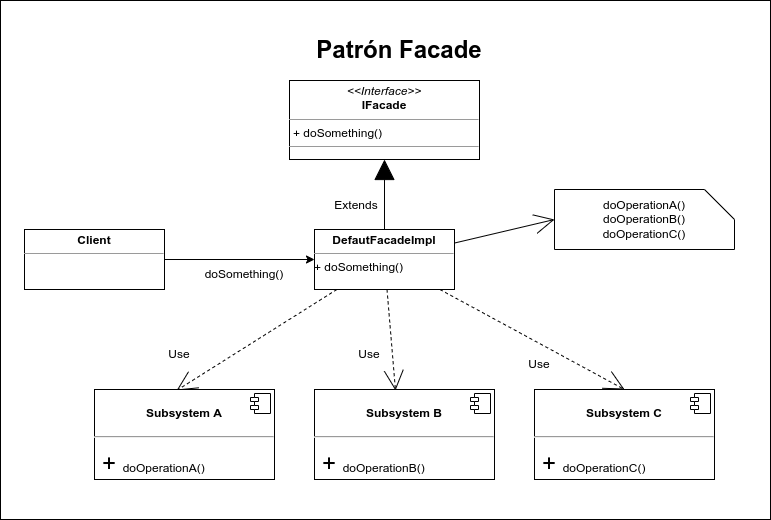

# Facade

El patrón Facade (Fachada) tiene la característica de ocultar la complejidad de interactuar con un conjunto de subsistemas proporcionando una interface de alto nivel, la cual se encarga de realizar la comunicación con todos los subsistemas necesarios. La fachada es buena estrategía cuando requerimos interactuar con varios subsistemas para realizar una operación concreta ya que se necesita tener el conocimiento técnico y funcional para saber qué operaciones de cada subsistema tenemos que ejecutar y en qué orden, lo que puede resultar muy complicado cuando los sistemas empiezan a crecer demasiado.

