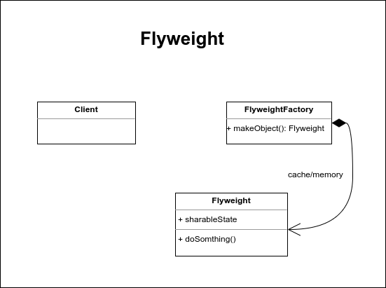

# Flyweight

Es un patrón que centra su atención en la construcción de objetos ligeros, mediante la abstracción de las partes reutilizables que pueden ser compartidas con otros objetos, esto con el fin de que en lugar de crear objetos cada vez que sea requerido, podamos reutilzar los objetos creados por otras instancias logrando con ello reducir en gran medida la capacidad de memoria requerida por la aplicación.

Este patrón es utilizado cuando la optimización de los recursos es algo primordial ya que elimina la redundancia de objetos con propiedades idénticas.

Muy a menudo creamos objetos que son exactamente iguales y en muchos de los casos no nos damos cuenta ya que esto no afecta a los recurso del sistema. Sin embargo, ¿qué pasaría si estos objetos idénticos empiezan a saturar nuestra memoria? Es allí cuando ponemos atención en el asunto y tratamos de dar una solución. Flyweight centra su estrategía en dividir los objetos en dos partes:

- **Estado Intrínseco:** Son aquellas partes de un objeto que se repiten y que muchos de los mismos objetos tienen e común. Esta parte por lo general no cambia, o si cambia, afecta a todos los objetos por igual. Esta parte es la que se separa del objeto original con el fin de compartirla con el resto de los demás objetos.

- **Estado Extrínseco:** Correspode a la parte única de cada objeto, la cual, es distinta a todas las demás por lo que no es cantidad a ser reutilizada o compartida.

**Nota:** Flyweight se apoya en patrón Factory Method para su implentación

