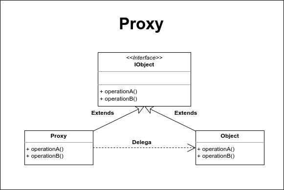

# Proxy

Este es un patrón de diseño que centra su atención en la mediación entre un objeto y otro. Se dice mediación porque este patrón nos permite realizar ciertas acciones antes y después de realizar la acción deseada por el usuario. El proxy se caracteriza por que el cliente ignora totalmente que una mediación se está llevando acabo debido a que el cliente recibe un objeto idéntico en estructura al esperado, y no es consciente de la iplementación tras la interface ejecutada, de esta manera el cliente interactua con el proxy sin saberlo.

Otro de los usos más comunes de los proxys es para representar de forma local objetos remotos que se encuentran en otro servidor o aplicación. El proxy actúa como una máscara para encapsular la lógica y ejecutar al objeto remoto.

