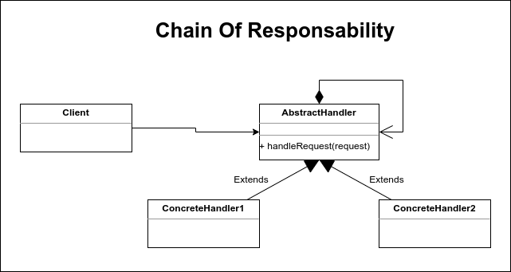

# Chain of Responsability

EL patrón de diseño cadena de responsabilidad (Chain of Responsability) es un patrón que se distingue por su versatilidad, permitiendo resolver problemas donde no estamos muy seguros de qué objeto deberá procesar una solicitud concreta; este patrón de diseño resuelve problemas fácilmente donde la herencia no puede. Apoyándose de una estructura en forma de cadena donde una secuencia de objetos tratan de atender una petición.

Mediante este patrón se evita el acoplamiento entre el que envía y el que recibe una petición. Por lo cual una serie de objetos encadenados reciben las peticiones, el mensaje pasa a através de la cadena hasta que alguno de los objetos encadenados sea capaz de procesar el mensaje.

