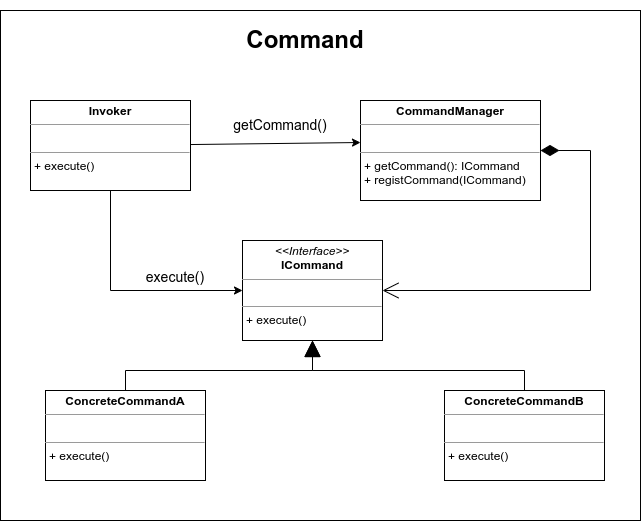

# Command

EL patrón de diseño Command nos permite ejecutar operaciones sin conocer los detalles de la implemantación de la misma. Las operaciones son conocidas como comandos y cada operación es implementada como una clase independiente que realiza una acción muy concreta, para lo cual, puede o no recibir parámetros para realizar su tarea. Una de las ventajas que ofrece este patrón es el de poder crear cuántos comandos requerimos y encapsulamos bajo una interface de ejecusión.

