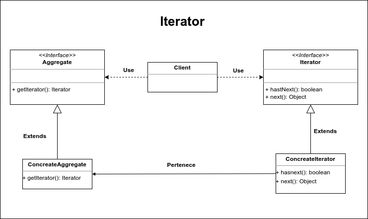

# Iterator

Este patrón de diseño permite recorrer una estructura de datos sin que sea necesario conocer la estructura interna de la misa. Es especialmente útil cuando trabajamos con estructuras de datos complejas, ya que nos permite recorrer sus elementos mediante un iterator, el iterator es una interface que proporciona los métodos necesarios para recorrer los elementos de la estructura de datos, los métodos más comunes son:

**hasNext:** Método que regresa un booleano para indicar si existen más elementos en la estructura por recorrer. True si existen más fasse si hemos llegado al final y no hay más elementos por recorrer.

**next:** Reqresa el siguiente elemento de la estructura de datos.

