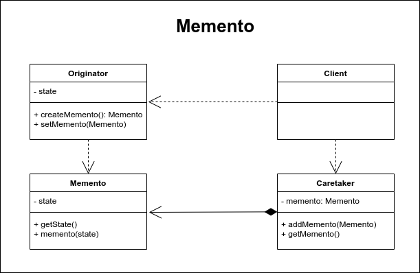

# Memento

Memento es un patrón diseñado que nos permite capturar el estado de un objeto en un momento determinado con la finalidad de regresar a este estado en cualquier momento. Este patrón es utilizado cuando tenemos objetos que cambian en el tiempo y por alguna razón necesitamos restaurar su estado a un momento determinado.

Un ejemplo claro de éstos es un editor de texto. Cada vez que escribimos una letra el editor de texto guarda un estado del documento, el cual nos permite viajar en los estados deshaciendo o rehaciendo los cambios que hemos hecho.

