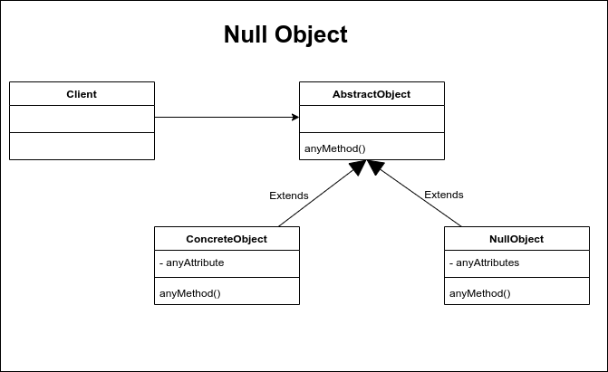

# Null Object

EL patrón de diseño Null Object nace de la necesidad de evitar los valores nulos que puedan originar error en tiempo de ejecución. Básicamente lo que este patrón propone es utilizar instancias que implementen la interface requerida pero con un cuerpo vacío en lugar de regresar un valor null.

Este patrón de diseño nos puede ayudar a evitar algunos problemas en tiempo de ejecucuón como el clásico NullPointerException o NullReferenceException de los lenguajes como java o C# y nos ahorra la tediosa tarea de preguntar si un objeto es nulo antes de usarlo.

