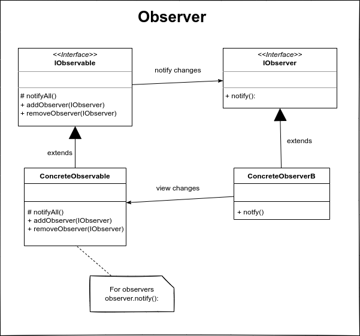

# Observer

El patrón de diseño observer permite observar los cambios producidos por un objeto, de esta forma, cada cambio que afecte el estado del objeto obsservado lanzará una notificación a los observadores; a esto se le conoce como Publicador-Suscriptor. Observer es uno de los principales patrones de diseño uilizados en interfaces gráficas de usuario (GUI), ya que permite desacoplar al componente gráfico de la acción a realizar.

Los objetos observados pueden tener uno o varios observadores, por lo que cuando un cambio ocurra en el objeto, todos loso observadores serán notificados del cambio.

El Observer está dividido en dos partes: el observable y el observador; el primero es el objeto que deseamos observar y el observador es el objeto qque está observando los cambios del Observable.

