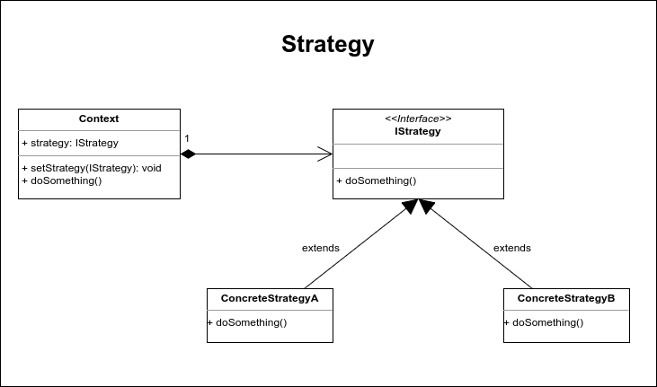

# Strategy

El patrón de diseño strategy perminte establecer en tiempo de ejecución el rol de comportamiento de una clase. Strategy se basa en el polimorfismo para implementar una serie de comportamientos que podrán ser intercambiados durante la ejecución del programa, logrando con esto que un objeto se pueda comportar de forma distinta según la estrategia establecida.

Este patrón suele trabajar en conjunto con el patrón Factory Method para la creación dinámica de las estrategias, pero no es requerido para su implementación. 

Strategy está compuesto por el contexto y las estrategias.

El contexto es una clase que encapsula la estrategia y su comportamiento está totalmente ligado a la estrategia concreta que contenga, por otra parte están las estrategias, las cuales son clases que definen un comportamiento concreto por lo que entre más estrategias existan más funcionalidad podrá tener el contexto.

