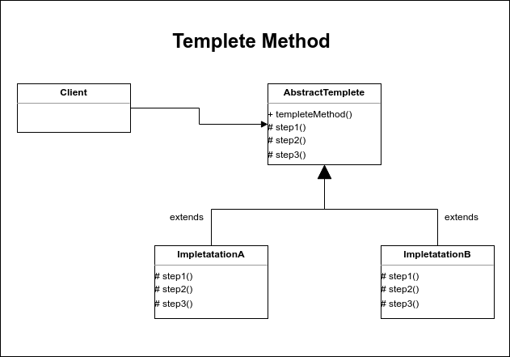

# Templete Method

El patrón de diseño templete centra su funcionalidad en la reutilización de código y se utiliza parar implemnetar algoritmos que realizan los mismos pasos para llegar a una solución. Esto se logra implemenando clases bases que definan un comportamiento predeterminado. Usualmente es creado un método para cada paso del algoritmo a implementar, de los cuales algunos serán implementados y otros permanaecerán abstractos hasta su ejecusión por parte de las subclases.

El patrón templete define además, un método público que permita a los usuarios del patrón ejecutar el tempete, este método se encargará de orquestar la ejecusión ordenada de los métodos o pasos del algoritmo.

