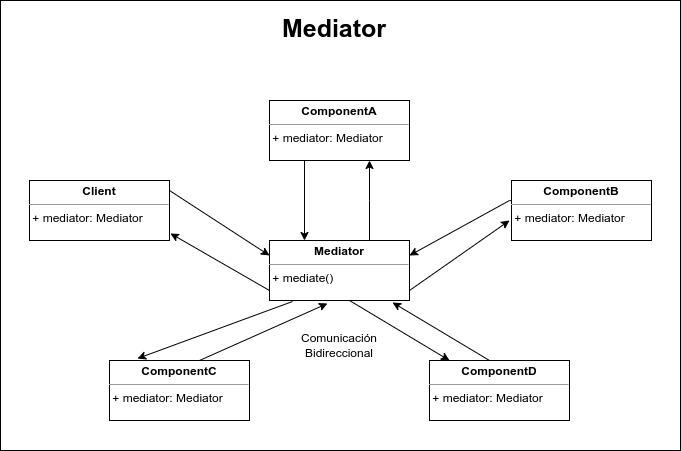

# Mediator

El patrón de diseño Mediator se encarga de gestionar la forma en que un conjunto de clases se comunican entre sí, Mediator e especialmente útil cuando tenemos una gran cantidad de clases que se comunican de forma directa, ya que mediante la implementación de este patrón podemos crear una capa de comunicación bidireccional, en la cual las clases se pueden comunicar con el resto de ellas por medio de un objeto en común que funge como un mediador o intermediario.

En proyectos grandes podemos llegar a tener un problema, y es que el número de clases aumenta y con esto también las relaciones que tienen las clases con el resto de clases del proyecto. Esto puede suponer un grave problema de acoplamiento con el resto de clases de nuestro proyecto, sobre todo por que creamos canales de comunicación directos y difíciles de rastrear o depurar.

